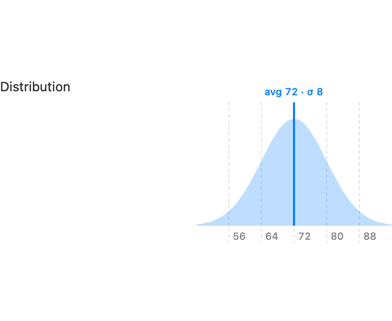
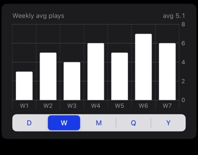
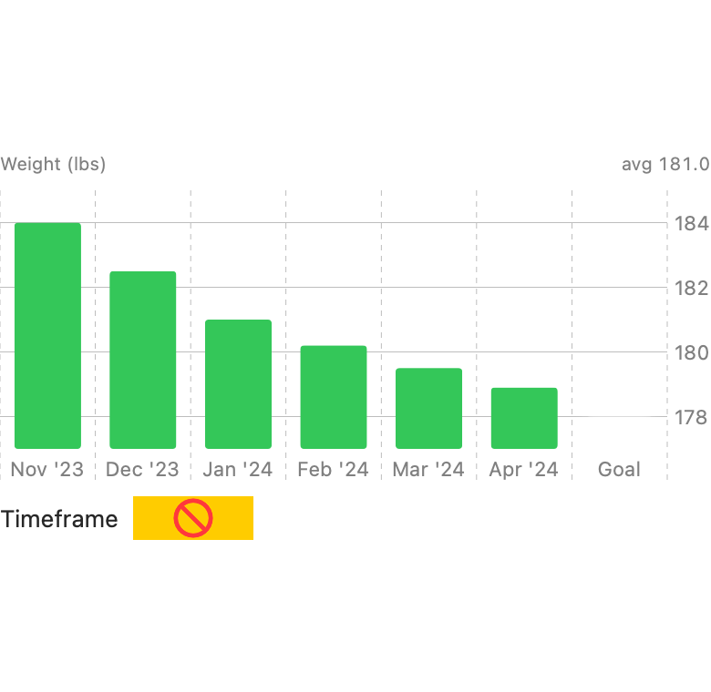

# ChartKit

Ready-made Swift Charts presentations for SwiftUI stats screens: a
day/week/month/quarter/year bar chart with a segmented picker, a goal-tracking
variant with a padded axis, and a normal-distribution curve fitted to a sample's
mean/stddev.

<!-- SCREENSHOTS:START -->
| Component | Preview |
| --- | --- |
| `NormalDistributionChart` |  |
| `PeriodBarChart` |  |
| `PeriodGoalBarChart` |  |
<!-- SCREENSHOTS:END -->

## Requirements

- iOS 17+ / macOS 14+
- Swift 5.9+

## Installation

```swift
.package(url: "https://github.com/sphericalwave/ChartKit.git", branch: "main")
```

## Overview

- `PeriodBarChart` — `Section`-ready bar chart switchable across
  day/week/month/quarter/year via a segmented picker. Feed it a
  `PeriodBarChart.DataSet` of `[ChartPoint]` per scale; scales with fewer
  than `minimumPoints` points are hidden from the picker instead of shown
  empty. The day scale plots against real dates (narrow weekday letters on
  the axis); coarser scales use short categorical labels — an ordinal
  "W1, W2, …" for week (a date string doesn't stay readable once there are
  more than a handful of bars), a formatted date for month/quarter/year.
- `PeriodGoalBarChart` — same day/week/month/quarter/year switching as
  `PeriodBarChart`, plus an optional glowing "Goal" bar and a **padded, non-zero
  y-domain** (`paddedDomain(points:goal:)`) so values that cluster in a narrow
  band — weight, waist, body-fat — stay visually distinct instead of flattening
  against a `0…max` axis. Every scale uses categorical labels (so the trailing
  goal bar fits on any scale), and it renders plain content — wrap it in your own
  `Section` or card. Pass `goal: nil` for the plain padded-axis bar chart.
- `NormalDistributionChart` — `Section`-ready normal curve fitted to a
  (mean, stddev, count) triple. Renders nothing if `stddev <= 0` or
  `count < 2` — no shape to show.
- `ChartTimeframe` — the `day/week/month/quarter/year` enum `PeriodBarChart`
  switches across. `RawRepresentable` (`String`), so it's safe to persist
  directly with `@AppStorage`.
- `ChartPoint` — a bucket's start date plus the value to plot. `PeriodBarChart`
  doesn't care whether `value` is a raw count or a per-day average — it just
  plots and averages whatever it's given.

Both chart views are meant to be used directly as children of a SwiftUI
`Form`:

```swift
import ChartKit

@AppStorage("statsScale") private var scale: ChartTimeframe = .week

Form {
    PeriodBarChart(
        data: .init(day: dailyPoints, week: weeklyPoints, month: monthlyPoints,
                    quarter: quarterlyPoints, year: yearlyPoints),
        selection: $scale
    )

    Section {
        PeriodGoalBarChart(
            data: .init(week: weeklyWeights, month: monthlyWeights),
            selection: $weightScale,
            goal: 185,
            title: "Weight (lbs)",
            barColor: .green
        )
    }

    NormalDistributionChart(mean: dist.mean, stddev: dist.stddev, count: dist.count)
}
```

## Dependencies

None.
