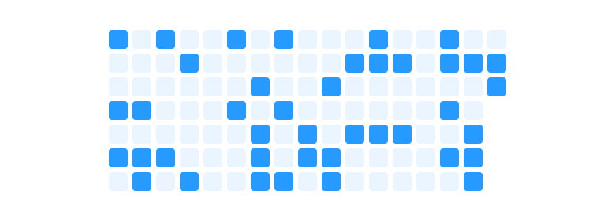
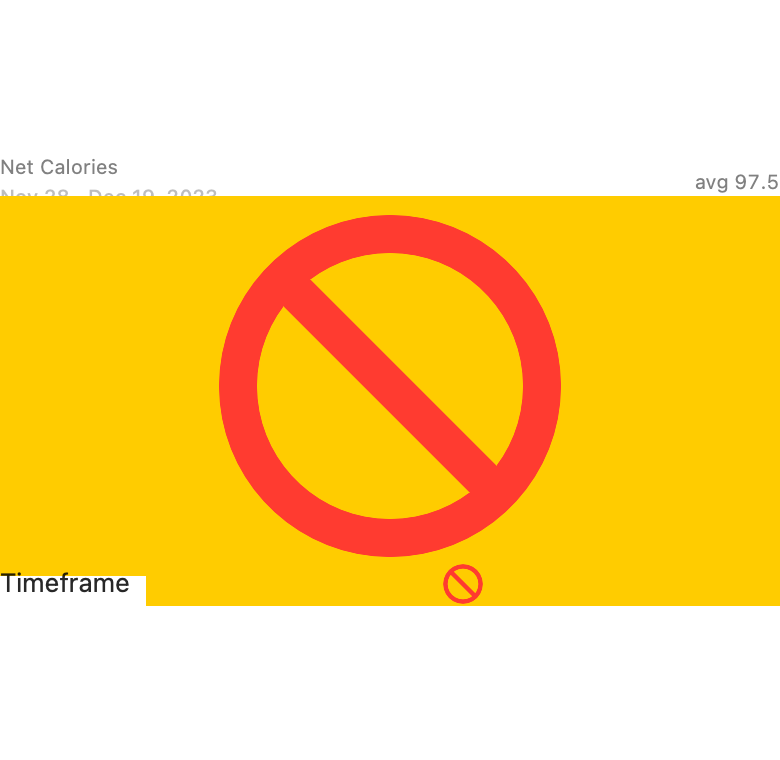
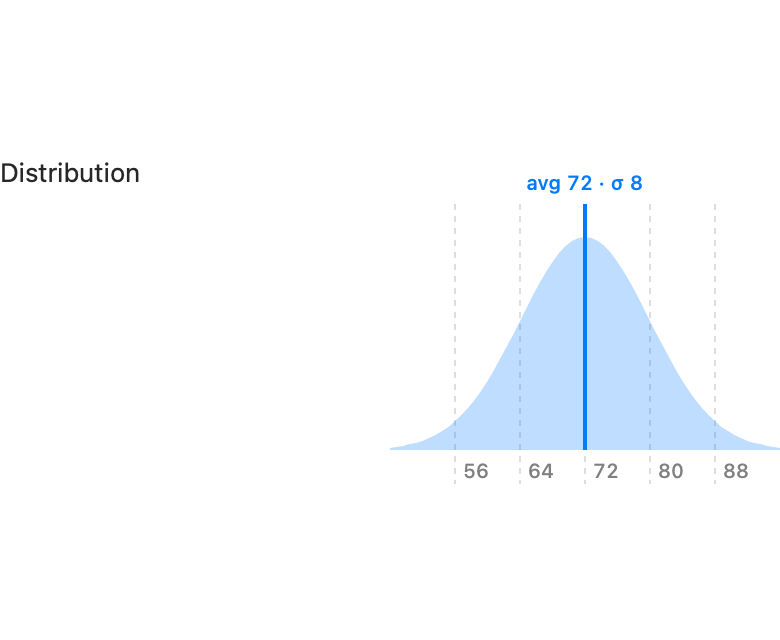
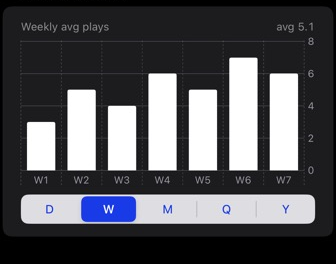
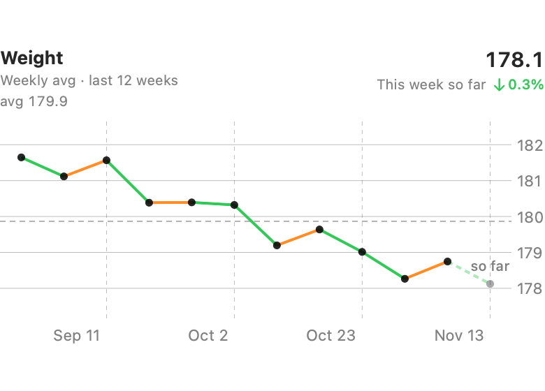
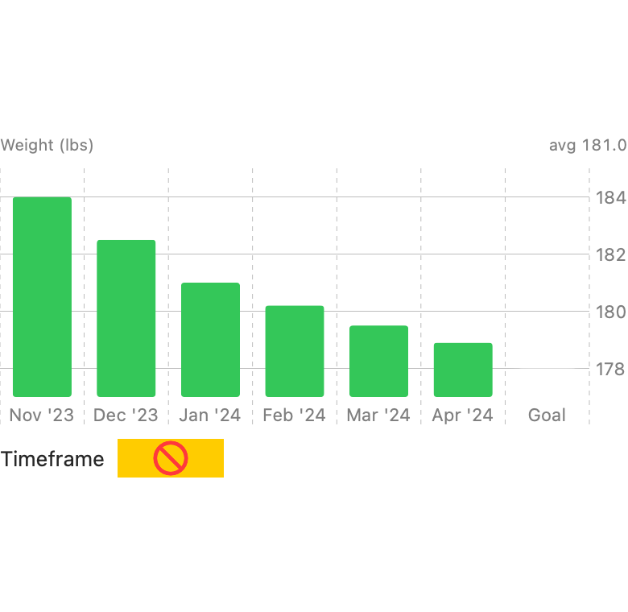
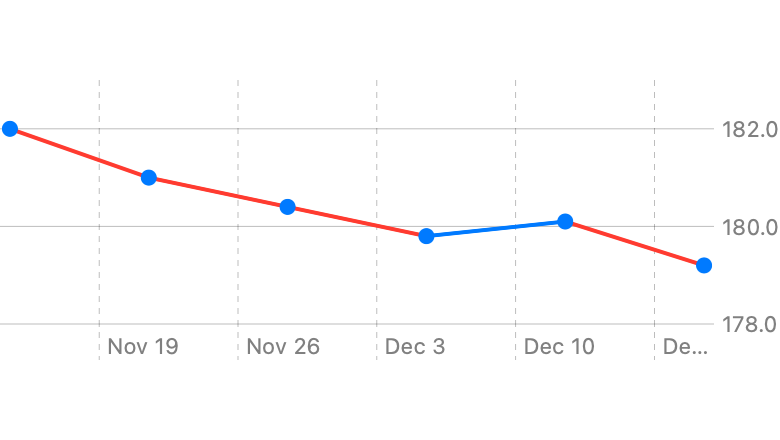
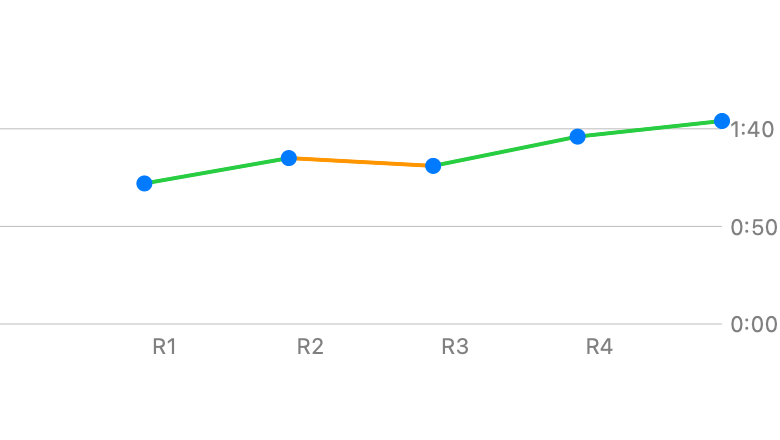

# SwCharts

> Formerly **ChartKit** (renamed 2026-10). Import `SwCharts`; the old
> `ChartKit` product has been removed.

Ready-made Swift Charts presentations for SwiftUI stats screens: a
day/week/month/quarter/year bar chart with a segmented picker, a goal-tracking
variant with a padded axis, and a normal-distribution curve fitted to a sample's
mean/stddev.

<!-- SCREENSHOTS:START -->
| Component | Preview |
| --- | --- |
| `CalendarHeatmap` |  |
| `NetPeriodBarChart` |  |
| `NormalDistributionChart` |  |
| `PeriodBarChart` |  |
| `PeriodChartView` |  |
| `PeriodGoalBarChart` |  |
| `PeriodPicker` |  |
| `SlopeColoredLineChart` |  |
| `SlopeColoredSeriesChart` |  |
<!-- SCREENSHOTS:END -->

## Requirements

- iOS 17+ / macOS 14+
- Swift 5.9+

## Installation

```swift
.package(url: "https://github.com/sphericalwave/SwCharts.git", branch: "main")
```

## Standard Day/Week/Month charts

The house standard for stats screens. New screens should use this rather than
`PeriodBarChart`'s hour…year scales.

| Period | Window | Bucket |
| --- | --- | --- |
| `D` | last 28 days | one point per local day |
| `W` | last 12 weeks | Monday-start weeks, local time |
| `M` | last 12 months | calendar months |

- **Aggregation is per metric.** Declare `MetricAggregation.sum` (calories,
  reps, sessions, minutes), `.average` (HR, score, %, weight), or `.max` /
  `.min` (heaviest set, peak/lowest HR) once; the chart labels it "total",
  "avg", "max" or "min". Samples first collapse to one value per day, then
  W/M buckets apply the same rule to the days that have data. Empty days are
  skipped, never counted as zero; an empty bucket is a gap.
- **The current week/month is partial**: drawn faded, labelled "so far", never
  projected.
- **Header**: average over the visible window, plus the latest period's value
  with % change vs the previous period. A partial `.sum` bucket shows no %
  change (a running total vs a finished one isn't like-for-like) and is left
  out of the window average.
- **Control**: `PeriodPicker` in the navigation bar's principal slot, its
  selection persisted per screen with `@AppStorage`.
- **Goal (optional)**: pass `goal: PeriodGoal(2.5)` (or
  `PeriodGoal(2000, direction: .atMost)`). It draws a dashed goal line across
  each bucket and tints each bar/point hit (`hitColor`, green) or miss
  (`missColor`, orange). For a `.sum` metric the value is **per day** and
  scales with the bucket (×7 for a week, × the month's length for a month).
  For `.average` / `.max` / `.min` it's a level applied to every bucket. A
  partial bucket is only tinted once its outcome is decided (an `.atLeast` sum
  that's already reached the goal, say). The header adds "goal X · n/m hit".

```swift
import SwCharts

struct NutritionStatsView: View {
    @AppStorage("nutritionChartPeriod") private var period: ChartPeriod = .week
    let calorieSamples: [DatedSample]   // one per meal, any number per day
    let weightSamples: [DatedSample]

    var body: some View {
        Form {
            Section {
                PeriodChartView(title: "Calories", samples: calorieSamples,
                                period: period, aggregation: .sum, style: .bar)
            }
            Section {
                PeriodChartView(title: "Weight", samples: weightSamples,
                                period: period, aggregation: .average,
                                risingColor: .orange, fallingColor: .green)
            }
        }
        .toolbar {
            ToolbarItem(placement: .principal) { PeriodPicker(selection: $period) }
        }
    }
}
```

Pieces, usable on their own:

- `ChartPeriod` — `day/week/month`, with `short` ("D"), `bucketCount`,
  `component`, and header wording. `String` raw values, safe for `@AppStorage`.
- `MetricAggregation` — `.sum` / `.average` / `.max` / `.min`, `label`, and
  `combine(_:)` (`nil` for no data).
- `PeriodGoal` — `target(for:aggregation:calendar:)` (per-period scaling) and
  `outcome(for:aggregation:calendar:)` (`.hit` / `.miss` / `nil`). Pure.
- `DatedSample` — a raw `(date, value)` observation.
- `PeriodBucketer` — pure: `buckets(for:period:aggregation:now:)` →
  `[PeriodBucket]` (`start..<end`, `value: Double?`, `isPartial`). Calendar
  and "now" are injected; `PeriodBucketer.standardCalendar(timeZone:)` is the
  Monday-first Gregorian calendar it uses by default. DST-safe.
- `PeriodSummary` — `windowAverage`, `latest`, `previous`, `percentChange`.
- `PeriodChartView` — the chart: `.line` (trend-colored like
  `SlopeColoredLineChart`, padded y-axis — for levels) or `.bar` (zero-based —
  for totals), a dashed window-average rule, and drag-to-read: slide across the
  chart and the header shows the bucket under the finger.
- `PeriodPicker` — the D/W/M segmented control.

## Overview

- `PeriodBarChart` — `Section`-ready bar chart switchable across
  day/week/month/quarter/year via a segmented picker. Feed it a
  `PeriodBarChart.DataSet` of `[ChartPoint]` per scale; scales with fewer
  than `minimumPoints` points are hidden from the picker instead of shown
  empty. The day scale plots against real dates (narrow weekday letters on
  the axis); coarser scales use short categorical labels — an ordinal
  "W1, W2, …" for week (a date string doesn't stay readable once there are
  more than a handful of bars), a formatted date for month/quarter/year.
- `PeriodGoalBarChart` — same day/week/month/quarter/year switching as
  `PeriodBarChart`, plus an optional glowing "Goal" bar and a **padded, non-zero
  y-domain** (`paddedDomain(points:goal:)`) so values that cluster in a narrow
  band — weight, waist, body-fat — stay visually distinct instead of flattening
  against a `0…max` axis. Every scale uses categorical labels (so the trailing
  goal bar fits on any scale), and it renders plain content — wrap it in your own
  `Section` or card. Pass `goal: nil` for the plain padded-axis bar chart, and
  `offeredScales:` (e.g. `[.day, .week, .month, .quarter]`) to keep a scale out
  of the picker even when there's data for it.
- `SlopeColoredLineChart` — line chart over dated points whose **segments are
  colored by trend**: one color where the line rises, another where it falls, so
  a run of good or bad periods reads at a glance without a legend. The y-axis is
  caller-supplied (`yDomain` + `yAxisLabel`) because it changes from instance to
  instance — a clock chart wants time labels and a domain a few minutes wider
  than the recorded range, a percentage chart wants `"%"` labels and a clamped
  domain. `risingColor`/`fallingColor` are yours to set too, since "up" isn't
  good for every metric. Renders plain content — wrap it in your own `Section`
  or card.
- `SlopeColoredSeriesChart` — the same trend-colored line for a series that
  isn't dated: x is a plain `Double` (a round number, seconds elapsed, a set
  index) instead of a calendar-day bucket, so per-round or per-second data
  doesn't collapse into a single day. Takes `xAxisLabel` as well as
  `yDomain`/`yAxisLabel` — a tick is drawn at every point's x, so keep the
  series short enough for the labels to fit. Feed it `[SeriesPoint]`.
- `NormalDistributionChart` — `Section`-ready normal curve fitted to a
  (mean, stddev, count) triple. Renders nothing if `stddev <= 0` or
  `count < 2` — no shape to show.
- `ChartTimeframe` — the `day/week/month/quarter/year` enum `PeriodBarChart`
  switches across. `RawRepresentable` (`String`), so it's safe to persist
  directly with `@AppStorage`.
- `ChartPoint` — a bucket's start date plus the value to plot. `PeriodBarChart`
  doesn't care whether `value` is a raw count or a per-day average — it just
  plots and averages whatever it's given.

Both chart views are meant to be used directly as children of a SwiftUI
`Form`:

```swift
import SwCharts

@AppStorage("statsScale") private var scale: ChartTimeframe = .week

Form {
    PeriodBarChart(
        data: .init(day: dailyPoints, week: weeklyPoints, month: monthlyPoints,
                    quarter: quarterlyPoints, year: yearlyPoints),
        selection: $scale
    )

    Section {
        PeriodGoalBarChart(
            data: .init(week: weeklyWeights, month: monthlyWeights),
            selection: $weightScale,
            goal: 185,
            title: "Weight (lbs)",
            barColor: .green
        )
    }

    NormalDistributionChart(mean: dist.mean, stddev: dist.stddev, count: dist.count)
}
```

## Dependencies

None.
